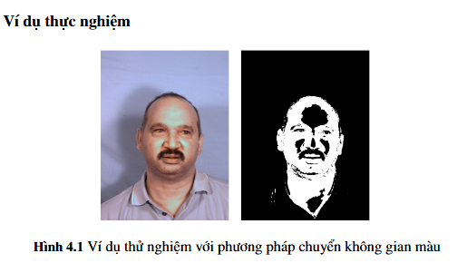
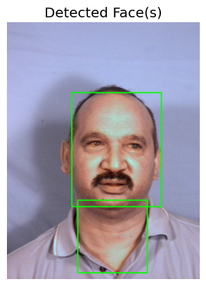
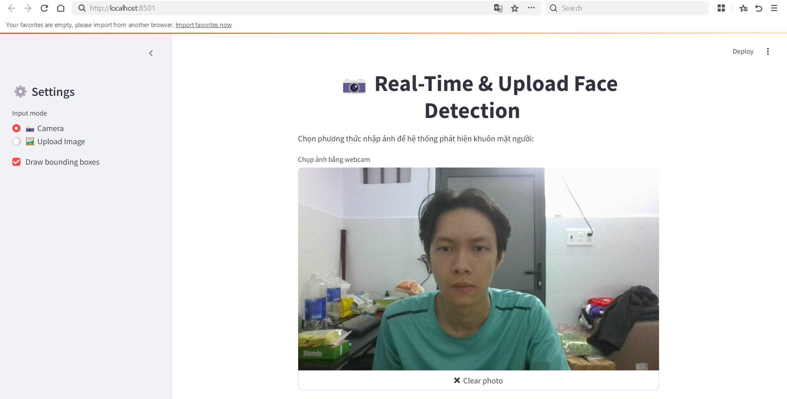
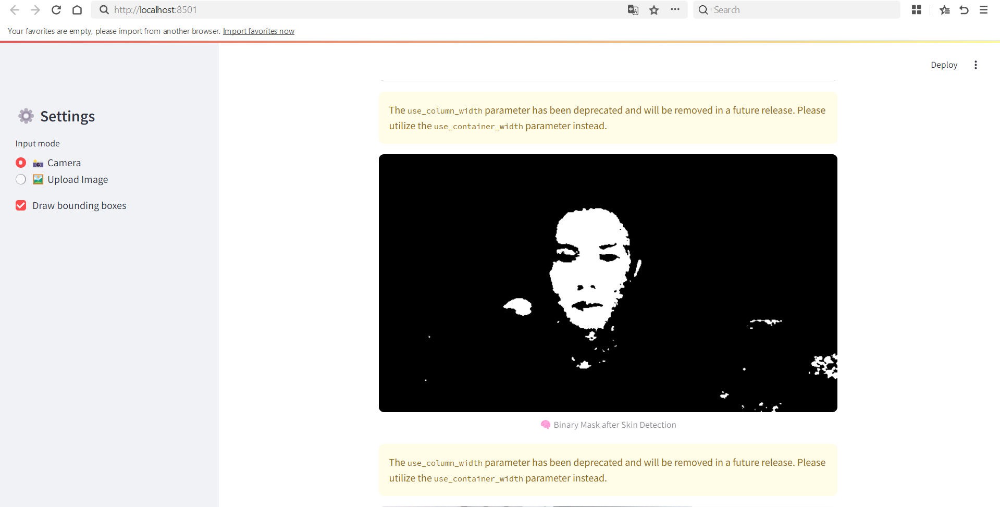
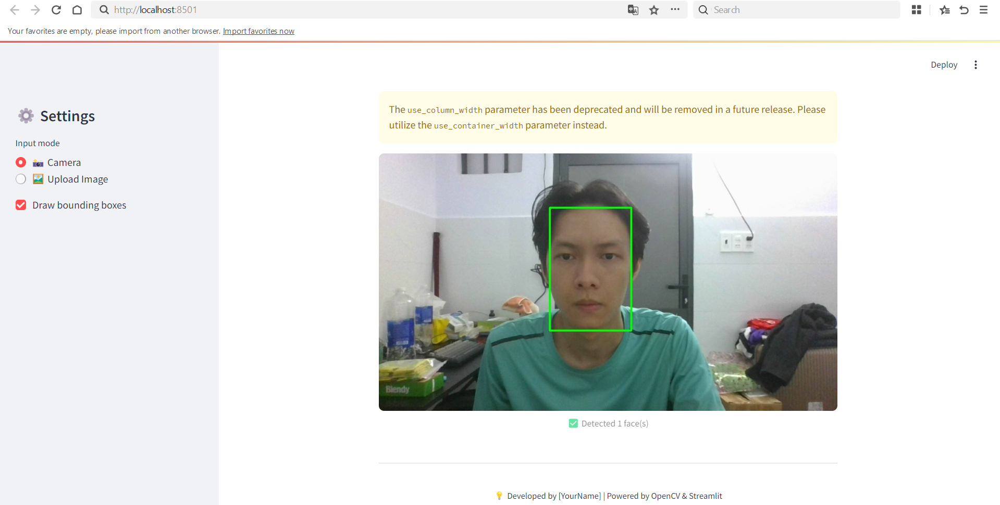

# [Pattern Recognition HCMUS 2025] Face Detection Using Hybrid Skim Color Model

---

## Giới thiệu

Trong thị giác máy tính, màu sắc luôn là một đặc trưng thường xuyên được sử dụng bởi tính đơn giản, bởi lẽ các phép toán với màu sắc có thể được cài đặt một cách nhanh chóng và hiệu quả, đồng thời trong môi trường ổn định với độ sáng đồng đều, màu sắc thường không bị tác động bởi sự thay đổi của hình học. Do đó, trong một số trường hợp, chỉ cần màu sắc là đủ để nhận dạng mọi sự vật.

Tuy nhiên, sự khó khăn chính hiện nay trong sử dụng màu sắc cho các ứng dụng thị giác máy tính là các camera thường không thể phân biệt được sự thay đổi của màu sắc do quang phổ của các nguồn ánh sáng khác nhau chiếu vào. Do đó, màu sắc thường nhạy cảm với sự thay đổi của nguồn sáng, điều này xảy ra rất thường xuyên trong môi trường không được kiểm soát. Các sự thay đổi này có thể được gây ra bởi sự thay đổi độ sáng(như bóng của vật thể), hoặc sự thay đổi cường độ ánh sáng (như ánh sáng mặt trời hoặc các nguồn sáng huỳnh quang từ bóng đèn, ...), hoặc cả hay sự thay đổi trên. Ngoài ra, các camera khác nhau và các mức điều chỉnh khác nhau có thể tạo ra nhiều bức ảnh khác nhau trong mắt con người.

Phát hiện mặt người đã trở thành một lĩnh vực thú vị trong các ứng dụng đa dạng sinh học chẳng hạn như giám sát đám đông, tương tác giữa con người và máy tính và nhiều lĩnh vực liên quan đến an ninh. Trong bài báo \cite{Yadav2016} đã đề cập rằng vấn đề phát hiện mặt người đang là xu hướng chính trong lĩnh vực nhận diện gương mặt hiện nay bởi vì chưa có thuật toán nào có thể tìm thấy gương mặt trong một ảnh cụ thể. Vấn đề phát hiện gương mặt vẫn còn gặp nhiều thách thức bởi vì do điều kiện ánh sáng khác nhau, tư thế thay đổi, độ phức tạp của nhiễu và nền ảnh. Trong đồ án này, chúng tôi sễ dựa vào đề xuất của bài báo \cite{Yadav2016} trình bày lại phương pháp cục bộ cho phát hiện gương mặt dựa vào việc phân đoạn màu da và đặc trưng khuôn mặt. Thuật toán này phân tích nhiều mô hình màu da như RGB, YCbCr, hay HSV, và kết hợp những kênh màu này cho việc phát hiện màu da vì phân đoạn được vùng da sẽ làm giảm được độ phức tạp của việc phát hiện gương mặt. Các vùng phân đoạn khuôn mặt dựa vào vùng da sẽ được phân loại bằng cách sử dụng một tập hợp các đặc trưng khuôn mặt như việc phát hiện các lỗ mắt miệng, bounding box, và tỷ lệ lệch tâm.

Phương pháp này sẽ được thực nghiệm trên bộ dữ liệu như: Pratheepan Dataset bao gồm 32 ảnh mẫu và ground truth khuôn mặt cá nhân và 46 ảnh mẫu và ground truth các ảnh khuôn mặt gia đình; CelebAMask-HQ Dataset bao gồm 30000 ảnh mặt người cùng với ảnh mask gương mặt; và Muct Database chứa 3755 ảnh mẫu. Phương pháp này cũng được hoạt động với những hình ảnh dưới một vài điều kiện ngoại lai.

Quy trình thực hiện đồ án này bao gồm: đầu tiên, ảnh đầu vào phải là ảnh màu RGB chứ không phải là ảnh đơn sắc; thứ hai, màu da nhân vật phải gần với màu da thật của người. Vùng màu da phải được trích xuất từ ảnh đầu vào sau đó vùng da này sẽ được áp dụng các đặc điểm gương mặt để xác định vị trí gương mặt trong ảnh đầu vào.

Ngoài ra, do việc thực thi mô hình này vẫn cho kết quả không cao so với bài báo gốc nên nhóm chúng em vẫn tham khảo và thực thi thêm phương pháp dùng các mô hình học sâu UNet để phân đoạn vùng da mặt trước sau đó sẽ xác định khuôn mặt có trong ảnh. Nhưng đây chỉ là phương pháp kiếm thử chứ chưa có một cách đánh giá quy chuẩn minh bạch nào cho phương pháp này. Phương pháp này vẫn được thực nghiệm trên các bộ dữ liệu CelebAMask-HQ, Paratheepan Dataset, và Muct Database.

## Phương pháp nghiên cứu

### 1. Phương pháp dùng mô hình lai kết hợp ba không gian màu

Phương án chuyển đổi không gian màu, sử dụng các không gian màu HSV và YCbCr để phát hiện màu da, và tạo một mask cho vùng da. Sau đó ta map tọa độ của mask này áp dụng lên ảnh gốc, các pixel nào nằm ngoài mask sẽ được filter về màu đen (tức giá trị pixel bằng 0), chỉ giữ lại các pixel ở ảnh gốc mà khớp với vùng mask. Sau đó, ta sẽ sử dụng một mô hình phát hiện khuôn mặt hiện đại để có thể phát hiện được khuôn mặt dựa trên ảnh mà ta đã áp dụng mask vào.

Việc sử dụng các phương pháp để phát hiện vùng da trước khi đưa vào các mô hình hiện đại để phát hiện khuôn mặt sẽ giúp máy sẽ loại bỏ được các vùng pixel không là ứng cử viên có thể là khuôn mặt (bởi các vùng này không phải là các vùng da). Các mô hình phát hiện khuôn mặt của ta sẽ chỉ tập trung vào những vùng mà chúng ta đã giới hạn giúp nó, việc này sẽ giúp cho việc xác định và phát hiện khuôn mặt trở nên chính xác hơn và ít tốn chi phí hơn vì nó không tập trung quá nhiều vào những phần chi tiết không đáng có.

#### 1.1. Tiền xử lý

Ban đầu, một bước tiền xử lý được thực hiện nhằm điều chỉnh độ sáng của bức ảnh. Cách tiền xử lý như sau:

* Chuyển bức ảnh RGB sang kênh màu YCbCr, và lọc ra kênh màu Y.
* Tính giá trị trung bình của kênh màu Y trên toàn bộ bức ảnh, gọi là $Y_{avg}$.
* Đặt giá trị ngưỡng $T$ dựa theo giá trị của $Y_{avg}$:
    $T = \left\{\begin{array}{ll}
    1.4, & Y_{avg} < 64 \\
    0.6, & Y_{avg} > 192 \\
    1, & \textit{Khi khác}
    \end{array}
    \right.$
* Thay đổi giá trị của hai kênh màu R và G: $R_{new} = R^T$, $G_{new} = G^T$.

#### 1.2. Thuật toán xác định màu da

Để xác định màu da, ta sử dụng thuật toán đặt ngưỡng đơn giản, với các ngưỡng được cho như sau:

* $R > 95$
* $G > 40$
* $B > 20$
* $R - G \ge 15$
* $R > B$
* $85 \le Cb \le 135$
* $10 \le Cr \le 45$
* $Y \ge 80$
* $0 < H < 35$ hoặc $325 < H < 360$
* $0.2 < S < 0.6$
* $V \ge 20$

Sau các phép so sánh, ta được một binary mask cho vùng da. Để làm giảm nhiễu cho mask này, ta sử dụng phương pháp median filter đơn giản.

#### 1.3. Thuật toán xác định khuôn mặt

Ta thực hiện thuật toán tìm thành phần liên thông để xác định các ứng cử viên cho khuôn mặt. Từ các ứng cử viên này, ta sẽ kiểm tra một số điều kiện để xác định đó có phải khuôn mặt hay không:

* Với mỗi ứng cử viên, ta tính hệ số Euler $E = C - H$, với $C$ là số thành phần liên thông và $H$ là số lỗ trống. Đây là một heuristics, trong việc khuôn mặt phải có đầy đủ hai mắt và miệng. Ở đây, điều đó được thể hiện qua phép so sánh $E \ge 0$. Nếu ứng cử viên không thoả điều kiện này, ta sẽ bỏ qua nó. 
* Sau đó, ta tìm bounding box và bounding ellipse của ứng cử viên. Ta đặt $R$ là tỉ lệ giữa chiều rộng và chiều cao của bounding box, và $E$ là tỉ lệ giữa đường chéo phụ và đường chéo chính của bounding ellipse. Khi đó, thành phần liên thông đó được tính là khuôn mặt khi nó thoả mãn 2 điều kiện: $R > 0.35$, và $0.1 \le E \le 0.89$.

Sau các bước này, ta đã có xác định được khuôn mặt trong ảnh.

### 2. Phương pháp dùng mô hình học sâu phân đoạn trên từng pixels

#### 2.1. Thu thập dữ liệu

Về phần thu thập dữ liệu, nhóm chúng em sẽ đi khảo sát các dữ liệu được gán nhãn sẵn vùng da mặt người, trong đó nhóm đã tìm hiểu được những bộ dataset sau đây có thể khả thi cho quá trình thực hiện đồ án.

##### CelebAMask-HQ Dataset

CelebAMask-HQ được giới thiệu lần đầu trong bài báo **MaskGAN: Towards Diverse and Interactive Facial Image Manipulation** bởi các tác giả Cheng-Han Lee and Ziwei Liu và Lingyun Wu and Ping Luo vào năm 2020, là một bộ dữ liệu về mặt người theo diện rộng bao gồm $30000$ ảnh mặt người với độ phân giải cao được chọn từ bộ dữ liệu CelebA theo CelebA-HQ. Mỗi ảnh có một bộ mask phân đoạn các đặc trưng khuôn mặt dựa theo CelebA. Những bộ masks của bộ dữ liệu CelebAMask-HQ đều được gán nhãn thủ công với kích thước ảnh mask là 512 x 512 và 19 lớp nhãn bao gồm tất cả các thành phần sinh học và phụ kiện có trên khuôn mặt từng người như da mặt, mũi, mắt trái, mắt phải, lông mày, tai, miệng, môi, tóc, nón, mắt kính, bông tai, dây chuyền, cổ và quần áo.

Bộ dữ liệu này được sử dụng rộng rãi trong nhiều nghiên cứu về phân đoạn khuôn mặt (face segmentation) và phân tích khuôn mặt (face parsing), được dùng để huấn luyện và đánh giá các mô hình nhận diện gương mặt và GANs cho việc tạo sinh và chỉnh sửa gương mặt.

Tuy nhiên, do đề tài bài toán về phát hiện khuôn mặt dựa trên vùng da được phân đoạn nên nhóm chúng em chỉ sử dụng các ảnh gốc và ảnh annotations về vùng da mặt được gán nhãn là skins từ bộ dữ liệu dataset như được biểu diễn trong hình \ref{celebamask}. Trong hình trên, hàng đầu tiên hiển thị toàn bộ ảnh gốc RGB có trong bộ dữ liệu CelebAMask-HQ, đồng thời từng annotation tương ứng về vùng da mặt được hiển thị ở dòng dưới.

Bộ dữ liệu này cũng tồn tại những ưu điểm và khuyết điểm nhất định như sau:
* **Ưu điểm** 
  * Độ phân giải và chất lượng hình ảnh của bộ dữ liệu này rất tốt, cho phép các mô hình segmentation học được rất nhiều chi tiết đặc trưng.
  * Dữ liệu chứa sự đa dạng về ánh sáng, góc chụp, biểu cảm và các yếu tố khác, hỗ trợ các mô hình học được các đặc trưng tổng quát và có khả năng ứng dụng trong nhiều tình huống thực tế.
  * Bộ dữ liệu được công bố rộng rãi và sử dụng làm benchmark trong nhiều nghiên cứu, tạo điều kiện so sánh hiệu năng của các mô hình khác nhau.
* **Nhược điểm**
  * Bộ dữ liệu này chỉ tập trung nhận điện vùng da mặt của một cá nhân nhất định chứ chưa có thể nhận diện nhiều vùng da mặt khác nhau có trong khung ảnh.

##### Bộ dữ liệu MUCT Landmark Database

Bộ dữ liệu MUCT (MUCT Landmarked Face Database) \cite{Milborrow10} bao gồm 3.755 ảnh chân dung của con người, mỗi ảnh được gán 76 điểm mốc (landmarks) do con người chú thích thủ công. Đây là một trong những tập dữ liệu 2D có số lượng landmarks cao nhất hiện có, nhằm hỗ trợ nghiên cứu trong nhận diện và phân tích khuôn mặt. Ảnh được chụp từ 5 góc camera khác nhau (trước, hai bên, hơi nghiêng lên, hơi nghiêng xuống) để mô phỏng điều kiện thực tế đa dạng.  Bao gồm nhiều độ tuổi, giới tính và sắc tộc khác nhau, với các biến thiên về ánh sáng nhằm tăng tính toàn diện của dữ liệu

#### 2.2. Tiền xử lý dữ liệu

Đầu tiên, ta sẽ đọc ảnh gốc dưới định dạng RGB và ảnh mask dưới dạng grayscale với threshold. Nếu kích thước ảnh gốc không bằng với kích thước ảnh mask, thì ta sẽ resize ảnh mask theo kích thước ảnh gốc.

Sau đó, ta sẽ sử dụng albumentations để resize ảnh và mask theo kích thước tiêu chuẩn 256 x 256 cũng như áp dụng augmentation (horizontal flip) để tăng độ chính xác trong quá trình huấn luyện. 

Sau đó ta sẽ trộn nhiều bộ dataset lại với nhau với kết hợp nhiều cặp (ảnh, mask) trên các folder tương ứng và nạp vào DataLoader để sử dụng trong quá trình huấn luyện và validation.

Trước khi huấn luyện, ta sẽ chia bộ dữ liệu gốc thành 3 tập khác nhau như tập huấn luyện với tỷ lệ 70\%, tập validation với tỷ lệ 15\% và tập testing với tỷ lệ 15\%.

#### 2.3. Fine-tuned mô hình phân đoạn UNet

Việc sử dụng mô hình UNet nhằm để phân đoạn vùng da trên mặt người. Mục tiêu phân đoạn nhằm để xác định vùng da mặt người một cách chính xác nhất, loại bỏ các không gian nền nhiễu hay các ánh sáng ngoại lai chiếu vào khuôn mặt làm giảm hiệu phát hiện khuôn mặt. Sau khi xác định được vùng da thì ta chỉ cần áp dụng các mô hình phát hiện gương mặt huấn luyện sẵn để xác định khuôn mặt nhằm làm tăng hiệu suất phát hiện khuôn mặt nhất có thể.

#### 2.4. Xác định và hiển thị vùng ROIs da

Sau khi ta đã phân đoạn được vùng da mặt, ta sẽ xác định vùng tọa độ ROIs vùng da trên ảnh mask và áp dụng lên ảnh gốc thông qua vùng liên thông, sau đó ta sẽ hiển thị lên ảnh gốc. Mục đích của bước này nhằm xác định hết tất cả các vùng da mặt trên ảnh nhằm loại bỏ đi các ảnh nền thừa và nhiễu bởi các chi tiết giống khuôn mặt.

Hình trên là ảnh kết quả của bước này. Trong đó, ảnh ban đầu là ảnh gốc, ảnh tiếp theo là ảnh mask được dự đoán bởi mô hình, ảnh thứ ba là ảnh sau khi cắt bỏ vùng da mặt, ảnh thứ 4 là ảnh sau khi vẽ contours, và ảnh cuối cùng là ảnh kết quả của quá trình trên.

#### 2.5. Áp dụng các mô hình pretrained phát hiện gương mặt

Sau đó, cuối cùng ta sẽ dùng các mô hình phát hiện gương mặt trên vùng ROIs đã được xác định bước trên. Ảnh kết quả cuối cùng sẽ hiển thị confidence của mô hình sau khi detect gương mặt, các điểm landmarks lên ảnh gốc.

Mô hình pretrained mà nhóm em sử dụng là mô hình MTCNN.

## Thực nghiệm và đánh giá kết quả

### 1. Phương pháp dùng mô hình lai kết hợp 3 không gian màu

#### 1.1. Thảo luận
Tuy nhiên thì phương pháp này tồn tại cả những ưu điểm cũng như khuyết điểm, sau đây sẽ là các ưu điểm và khuyết điểm của phương pháp này mà chúng em nhận thấy được sau quá trình thử nghiệm:
* **Ưu điểm**
  * Ta có thể thấy được ngay rằng phương pháp này rất ít tốn chi phi về cả bộ nhớ lẫn thời gian để chúng ta có thể xác định và giới hạn lại phạm vi tìm kiếm. Bởi việc chỉ dùng các ngưỡng của các không gian màu như HSV và YCbCr để có thể lọc các pixel ít có khả năng là da người thì nó chỉ mất chi phí tính toán của chúng là 0(1) cho từng pixel với việc chỉ cần so sánh giá trị pixel với các ngưỡng đã đề sẵn.
* **Nhược điểm**
  * Nhưng chính việc đơn giản là chỉ sử dụng các ngưỡng để lọc các pixel không phải là vùng da thì nó sẽ dễ cho ra các sai xót và không tối ưu được việc giới hạn phạm vi tìm kiếm. Đây là một vẫn đề mà chúng em gặp phải khi thử nghiệm phương pháp này.
    * Ví dụ thực nghiệm
    
      
      * Trong hình gốc và kết quả ở trên, ta có thể thấy rằng thuật toán sử dụng các ngưỡng từ các kênh màu RGB, HSV và YCbCr đã làm rất tốt trong việc khoanh vùng và giữ lại các pixel vùng da. Nhưng ta cũng có thể dễ dàng thấy được các vùng da quá sáng do ảnh hưởng của ánh đèn sẽ không thể được nhận diện bởi thuật toán này, khiến cho nhiều chỗ ta sẽ thấy có một khoảng màu đen. Nhưng nhìn chung thì nó đã loại bỏ được các thành phần râu ria khác, tối ưu được phạm vi tìm kiếm và phát hiện khuôn mặt cho ta. Dưới đây là hình ảnh kết quả khi đã lọc các ứng cử viên thông qua các điều kiện như về euler về bounding box ratio và eccentricity.
      
      
      * Có thể thấy bounding box của chúng ta cũng khá là chính xác khi bounding box thứ nhất đã phát hiện được đúng vùng khuôn mặt, cho thấy thuật toán của ta cũng có khả năng để nhận diện được khuôn mặt thông qua việc ta dùng các điều kiện về các thành phần liên thông, số lỗ ở trong vùng ứng cử viên và tỉ lệ của bounding box. Nhưng có thể thấy rằng bounding box thứ 2 của ta lại cho rằng vùng da ở cổ này cũng là một khuôn mặt. Nguyên nhân có thể là do ánh sáng đã làm cho da ở một số vùng ở cổ nằm ngoài ngưỡng da và khi kiểm tra và tính toán các thành phần liên thông (nó sẽ lấy luôn cả vùng liên thông bên dưới luôn, tại vì nó không thể biết được đâu là mặt và cổ).

#### 1.2. Đánh giá và nhận xét

Trong phần đánh giá này nhóm sẽ sử dụng bộ dữ liệu là \textbf{Muct Database} để đánh giá hiệu suất của hướng nghiên cứu này thông qua việc tính toán IoU của bounding box mà mô hình dự đoán được so với ground truth được trích xuất thông qua các landmarks được cung cấp trong bộ dữ liệu này. 

| Approach                                                           | FDC (\%) | DSC (\%) |
| ------------------------------------------------------------------ |:--------:|:--------:|
| Proposed method                                                    |   1.0    |    57    |
| Viola Jones                                                        |   6.7    |  95.87   |
| Face detection in color images                                     |   4.5    |   99.2   |
| Fast face detection based on skin segmentation and facial features |   2.4    |   99.6   |

* Chỉ phát hiện được 0.57 số khuôn mặt thực sự tồn tại trong ảnh → cực kỳ thấp. 
* Điều này cho thấy rằng việc ta áp dụng các ngưỡng không gian màu như là RGB, HSV hay là YCbCr để có thể lọc được các pixel là da phục vụ cho việc phát hiện khuôn mặt này chưa thực sự hiệu quả và cho ra một kết quả rất thất vọng. 
* Nguyên nhân ta có thể liệt kê như sau:
  * Đầu tiên là nếu ta đặt ngưỡng như vậy thì nó sẽ không thực sự hiệu quả bởi vì mỗi người, mỗi khu vực có một màu da và sắc thái da khác nhau, đậm nhẹ tùy từng khu vực do đó ngưỡng này có thể phù hợp với khu vực và người này nhưng có thể không phù hợp với những người khác ở những khu vực sinh sống khác.
  * Tiếp theo là hình ảnh khi được chụp có thể chịu ảnh hưởng của các yếu tố tự nhiên bên ngoài như là ánh sáng, có thể vật thể trong ảnh sẽ chịu nhiều màu ánh sáng khác nhau vì như ta biết ánh sáng mặt trời khi đi qua các lăng kính có màu khác nhau (tức chỉ cho màu đó đi qua chẳng hạn như khi ánh sáng mặt trời đi qua lăng kính chỉ cho màu đỏ đi qua thì lúc đó da ta sẽ chịu ảnh hưởng của sắc thái đỏ), nhưng cùng lúc đó một bộ phận khác của da mặt chúng ta lại chịu ảnh hưởng sắc thái màu từ đèn led chẳng hạn. Tất cả những điều này làm cho màu da của chúng không đồng đều và dẫn đến ảnh hưởng khá nhiều trong việc phân đoạn vùng da.
  * Cuối cùng: giả sử chúng ta hoàn thành các công đoạn trên trơn tru và hoàn hảo, không có chuyện gì xảy ra, nhưng nếu nhưng việc ta xác định được vùng nào là mặt người sau khi đã làm một lớp mặt nạ cho vùng da cũng cực kì khó khăn. Với hướng tiếp cận từ bài báo, ta cần phải tính toán và loại dần các ứng cử viên cho khuôn mặt, chẳng hạn như ta không được chọn vùng nào có bounding box quá nhỏ, hoặc quá to. Và thêm một cái nữa là ta sẽ tính toán số lượng thành phần liên kết ở trong vùng đó cũng như là các lỗ (như mọi người cũng biết thì các vùng như mắt mũi miệng của ta sẽ không nằm trong ngưỡng vùng da cho nên nó sẽ tạo thành các lỗ đen trên vùng mặt ta có thể dựa vào đây để giảm thiểu số lượng candidates).
* Nhưng có một điểm ở đây mà mô hình này làm được mà ta có thể dễ dàng nhìn thấy được từ bảng số liệu trên với FDC chỉ là 1\%, tức là việc các bounding box được sinh ra sai trong việc phát hiện khuôn mặt là rất thấp.

### 2. Phương pháp dùng mô hình học sâu phân đoạn vùng da mặt theo từng pixel

#### 2.1. Thảo luận

Tuy nhiên, phương pháp này vẫn còn tồn tại những ưu điểm và nhược điểm trong quá trình thử nghiệm và nghiên cứu:
* **Ưu điểm**
  * Phương pháp này có thể giúp chúng ta xác định chính xác vùng da mặt nhằm giúp chúng ta tiết kiệm thời gian để xác định và giới hạn lại phạm vi tìm kiếm. Bởi lẽ, việc phân loại từng pixel vùng da mặt giúp chúng ta xác định được vùng da mặt mà không ảnh hưởng đến các yếu tố ngoại lai khác ảnh hưởng đến ảnh.
* **Nhược điểm**
  * Phương pháp này chỉ giới hạn ở việc nhận dạng được một vùng mặt người nhất định do việc bộ dữ liệu để huấn luyện mô hình còn hạn chế. Nên khi có nhiều người xác định cùng một lúc thì sẽ gây khó khăn trong việc trích xuất vùng da và xác định gương mặt.

#### 2.2. Đánh giá và nhận xét

Trong phần đánh giá này nhóm sẽ sử dụng bộ dữ liệu là \textbf{Muct Database} để đánh giá hiệu suất của hướng nghiên cứu này thông qua việc tính toán IoU của bounding box mà mô hình dự đoán được so với ground truth được trích xuất thông qua các landmarks được cung cấp trong bộ dữ liệu này.

Đối với phương pháp này, chúng ta cũng chỉ phát hiện được $68\%$ số khuôn mặt trong ảnh. Điều này cho thấy dù chúng ta có phân đoạn vùng da theo từng pixels thì vẫn bị lỗi do chồng lấp mặt người dẫn đến kết quả thấp không như mong đợi.

## Demo

### 1. Phương pháp dùng mô hình lai kết hợp 3 không gian màu

Ở phương pháp này thì nhóm cũng có xây dựng một ứng dụng web bằng streamlit cho phép người dùng thực hiện việc chụp ảnh mặt của mình hoặc upload 1 ảnh để có thể thử nghiệm được mô hình phát hiện khuôn mặt với phương pháp sử dụng chuyển đổi không gian màu và các ngưỡng không gian màu.

### 2. Phương pháp dùng mô hình học sâu phân đoạn trên từng pixels

Ở phương pháp này thì nhóm cũng có xây dựng một ứng dụng web bằng streamlit cho phép người dùng quay video real time để có thể thử nghiệm mô hình và hệ thống để phát hiện khuôn mặt với phương pháp sử dụng mô hình phân đoạn UNet để phân đoạn vùng da từng pixels và mô hình MTCNN để xác định khuôn mặt.

Link Youtube: [here](https://www.youtube.com/watch?v=j1fjDO7i2Wo)

<!-- BEGIN YOUTUBE-CARDS -->

<!-- END YOUTUBE-CARDS -->

## Source code & Báo cáo

Tất cả code và tài liệu đều được trình bày rõ ràng trong link Drive sau: [here](https://drive.google.com/drive/folders/1F7VALAKLUHfzUMJve76h0NUxRQedyNdR?usp=sharing)

